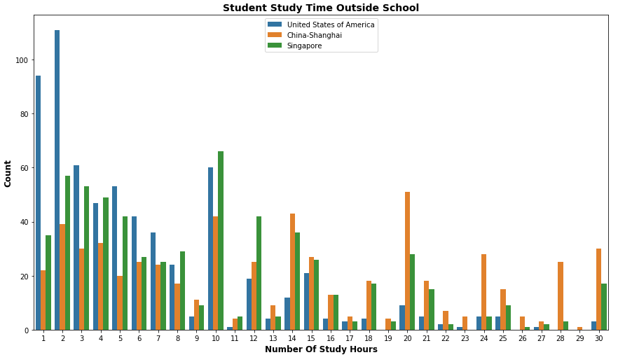

# Udacity Data Analytics Nanodegree
## Communicate Data Findings Project  

## PISA Data Overview

The  Organization for Economic Co-operation and Development (OECD) https://www.oecd.org/ runs a program called PISA. PISA (Program for International Student Assessment) is a survey of students' skills and knowledge as they approach the end of compulsory education. It is not a conventional school test. Rather than examining how well students have learned the school curriculum, it looks at how well prepared they are for life beyond school. Around 510,000 students in 65 economies took part in the PISA 2012 assessment of reading, mathematics and science representing about 28 million 15-year-olds globally.
  
According to the OECD publication called
**PISA 2012 Results in Focus "What 15-year-olds know  and what they can do  with what they know"**, the top two countries in Mathematics performance among 15-year old students was Shanghai, China and Singapore. The United States ranked 36 out of 65 countries in mathematics among 15-year old students. The rankings are based on the 2012 Mean PISA score in mathematics calculated for each country.

## Project Goals

This project attempts to identify similarities and differences among the United States and the top two countries in math literacy, China and Singapore. The 2012 PISA data file is a compilation of responses to questionnaires given to students, parents, and schools in all 65 countries in the survey. The data file for this project is limited to China, Singapore, and United States of America.

## Jupyter Notebooks
### PISA Data Part 1
This notebook loads the raw PISA CSV file data file into a sqlite database. It then transforms and loads a subset of PISA data columns for the United States, China, and Singapore countries into a new CSV file.

### PISA Data Part 2
Separate Pandas DataFrames are created for creating the Univarate, Bivariate, and Multivariate visualizations of PISA data for the United States, China, and Singapore countries.

## Summary of Findings

The two key findings are the number of hours 15-year old students spend outside of school studying and the number of math classes taken per week. The plots reveal that most students from China and Singapore spend between three and ten hours a week outside of school studying, while most students in the United States spend between one and five hours a week studying outside of school. The students in China and Singapore who study more than five hours per week show much higher math literacy scores than students in the United States.

Most United States students take between one and five math classes per week while most China and Singapore students take at least five math classes per week. China and Singapore students who take five or more math classes per week score much higher on math literacy than students in the United States.

## Key Insights for Presentation

A correlation was found between the number of out of school study hours and math literacy scores. Because most students in China and Singapore spend more hours studying outside of school, they scored much higher in math literacy than 15-year old students in the United States. The same correlation exists for the number of math classes taken per week. The students from China and Singapore are taking the highest number of math classes per week and scored highest on math literacy.

## Final slide presentation
A slide presentation summarizing the key findings is saved to `2012_PISA_Study_slides.pdf`

## Resources

**Publications**

- PISA 2012 Results in Focus "What 15-year-olds know  and what they can do  with what they know" 
http://www.oecd.org/pisa/keyfindings/pisa-2012-results-overview.pdf  
- Student questionnaire Form A
- Student questionnaire Form B
- Student questionnaire Form C
- Student questionnaire Form UH 
http://www.oecd.org/pisa/data/pisa2012database-downloadabledata.htm 
- PISA 2012 Technical Report 
https://www.oecd.org/pisa/pisaproducts/PISA-2012-technical-report-final.pdf  

**Video training**

Visualizing Statistical Data using Seaborn by Janani Ravi 
https://app.pluralsight.com/library/courses/seaborn-visualizing-statistical-data/table-of-contents
